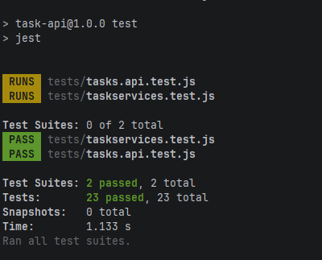
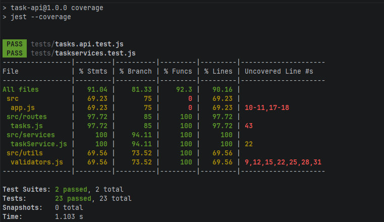

# Day 1 Notes — Read & Test

## What I did

- Read the code under `task-api/src/` to understand the current behavior of the API and the in-memory task store.
- Added **unit tests** for the service layer (`src/services/taskService.js`).
- Added **integration tests** for the HTTP API using **Supertest** against the exported Express app (`src/app.js`).
- Ran the full test suite and generated a coverage report.

## Where the tests are

- Unit tests: `task-api/tests/taskservices.test.js`
- Integration tests: `task-api/tests/tasks.api.test.js`

## What is covered

### Unit tests (service)

- `create()` creates tasks and sets defaults
- `getAll()` returns a copy of the list
- `findById()` finds existing tasks / returns `undefined` for missing
- `update()` updates fields / returns `null` if the task does not exist
- `remove()` deletes tasks / returns `false` if the task does not exist
- `completeTask()` marks complete / returns `null` if the task does not exist
- `getByStatus()` filters by status
- `getPaginated()` returns a slice for the given page/limit
- `getStats()` returns per-status counts + overdue count

### Integration tests (routes)

Happy path coverage for each documented endpoint:

- `GET /tasks`
- `GET /tasks?status=todo`
- `GET /tasks?page=1&limit=10`
- `POST /tasks`
- `PUT /tasks/:id`
- `DELETE /tasks/:id`
- `PATCH /tasks/:id/complete`
- `GET /tasks/stats`

Edge cases included:

- `POST /tasks` returns `400` for invalid title
- `PUT /tasks/:id` returns `404` when task does not exist
- `DELETE /tasks/:id` returns `404` when task does not exist
- `PATCH /tasks/:id/complete` returns `404` when task does not exist

## How to run

From `task-api/`:

```bash
npm test
npm run coverage
```

## Coverage summary

Generated via `npm run coverage`:

- Statements: **91.04%**
- Branches: **81.33%**
- Functions: **92.3%**
- Lines: **90.16%**

```text
File              % Stmts  % Branch  % Funcs  % Lines
All files           91.04     81.33     92.3    90.16
 src                69.23        75        0    69.23
  app.js            69.23        75        0    69.23
 src/routes         97.72        85      100    97.72
  tasks.js          97.72        85      100    97.72
 src/services         100     94.11      100      100
  taskService.js      100     94.11      100      100
 src/utils          69.56     73.52      100    69.56
  validators.js     69.56     73.52      100    69.56
```

## Screenshots

### Test run (`npm test`)



### Coverage report (`npm run coverage`)



